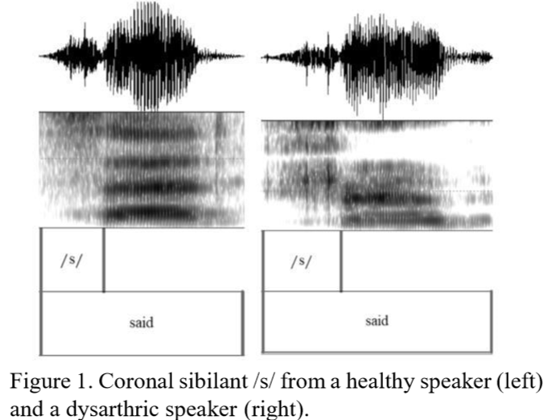

# Dysarthric speech classification
- This is the code used in my 2019 conference paper.
  - Abner Hernandez & Minhwa Chung (2019). Dysarthria Classification Using Acoustic Properties of Fricatives. Proceedings of the 2019 Seoul International Conference on Speech Sciences, 43-44.
- It was inspired by my earlier journal paper which was an analysis of fricatives from dysarthric speech.
  - Abner Hernandez, Ho-Young Lee & Minhwa Chung (2019). Acoustic analysis of fricatvies in dysarthric speakers with cerebral palsy. Phonetics and Speech Sciences. 11(3), 23-29.
  
  
## My training Procedure
1. Annotate fricatives (I did this manually with praat). http://www.fon.hum.uva.nl/praat/
  - 
2. Extract the following features: **duration, center of gravity, variance, skewness, kurtosis.**
  - This was done automatically with a praat script (*spectral_moments.praat*).
  - **Center of gravity** is the frequency which divides the spectrum in a way that the top-half frequencies are equal to the low-half frequencies. 
  - **Variation will** tell us whether most energy is concentrated in a small band or dispersed over a wide range of frequencies. 
  - **Skewness** will measure the shape of the spectrum below the mean peak compared to the frequencies above the mean peak.
  -  **Kurtosis** describes the peakness of energy distribution. A positive kurtosis suggests that spectral peaks are well defined while a negative kurtosis suggest a spectrum with a flat distribution.
  
3. Split data into train and test sets
4. Train different classifiers (I tested out random forest, K-nearest neihbours, and support vecor machines)
  - I also used k-fold cross validation on the train set when trying to fine tune parameters.
  - All machine learning models and tools were done with sci-kit learn. https://scikit-learn.org/stable/index.html
5. Use best model for final test set.
6. Evaluate with accuracy, precision, recall, F1-score

## Final Notes
- Check the fric_class.ipynb files to see the classifier building and training process.
- I also show the praat script which extracts the fricative measures (I just modified a previous script). 
- This was a small project that mostly started as a way for me to practice using sci-it learn so I'm sure there are many things I could do to improve the models and obtain better accuracy, but for now I likely won't change much in this repository.
